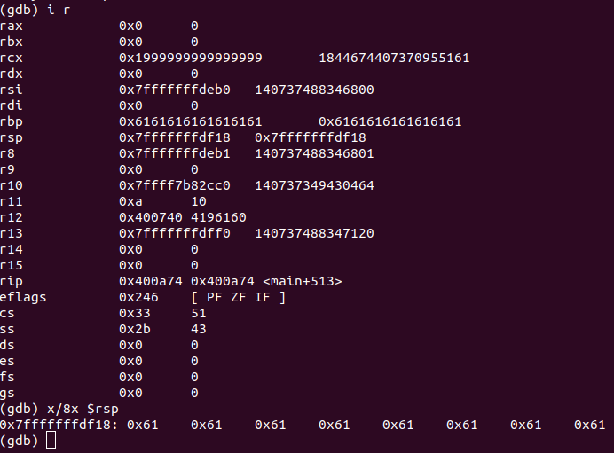

#Write-Up to ACI{Your Cup Overfloweth- 75pts}

##Hints:

###Here are the things we have/know from the beginning:
- We have a compiled and executable binary of the file
- The name of the challenge implies an overflow of some kind i.e. a buffer overflow
- The 'cup'/stack is executable
- User input is not restricted
- We will need a 'gadget' of some kind
- We don't want any newline or `0x0a` in our payload (because execution sometimes looks for `0x0a` as an endpoint to certain instructions and could mess with our payload)

###Recon on the file:
Running the `file` command on `cup` reveals:

- It is 64 bit
- Dynamically linked
- Not stripped (thank god)

###Description of what happens when the file is run:
Running `./cup` gives the following prompt:

When we give it any number from 0-5, it returns:

It then asks us to fill our cup:

Choosing '9' returns and exits execution.

Note: When the program is run for a set amount of time, it automatically ends execution and prints:

###Overflowing the cup:
By running `cup` with `gdb`, we find that we can control `rsp`:

I did the following with `gdb`:

- placed a breakpoint on the main function (`breakpoint main`)
- placed a breakpoint on the address where the return instruction occured (`breakpoint *0x0000000000400a74`)

I then ran `cup`, chose `1`(Flute), and input 'a'\*500 into the cup. This then asked to fill the cup again (I gave it a single `1` again) and then I chose `9` to return when prompted.

I checked the address I was returning to and found:

This is critical because, while `rsp` usually acts as the stack pointer in 64 bit, when a function returns, it loads the next address to execute.

###Constructing an exploit:

We want to gain a shell so we can, presumably, get the flag when we connect to the ACI service running `cup`.

General overview of exploit:

- We will fill our buffer with junk
- We will change rsp to point to our shellcode
- We will have shellcode that spawns a shell

The first step is to find the size of the buffer:
Using `gdb` we find that the buffer is 136 bytes long.

We then want to find a 'gadget' that `jmp rsp` so that we can place our shellcode right after the instruction. The `jmp rsp` will move rsp by 8 bytes (64-bit) and then execute our schellcode. This is easily done with ROPgadget:

Address of jump rsp instruction : [0x0000000000400827]

Finally, we need our shellcode. Luckily, there are plenty of resources online that can help with this.
Shellstorm provides the 64-bit shellcode for spawning a shell from /bin/sh [ShellStorm](http://shell-storm.org/shellcode/files/shellcode-806.php):

`Shellcode = '\x31\xc0\x48\xbb\xd1\x9d\x96\x91\xd0\x8c\x97\xff\x48\xf7\xdb\x53\x54\x5f\x99\x52\x57\x54\x5e\xb0\x3b\x0f\x05'`

We now have all of the components of our payload. We then construct a simple python script so that we don't have to manually input our responses to the service.

When we run this python script we get:

Once, the interactive shell opens up we `ls` to find out what is in the directory we landed in and `cat` the found flag file.

We've have gotten our flag! `ACI{2dc6372f0c9ffb6f27c5a0fd0c6}`