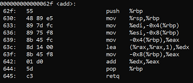

# Team Notes

## Practice Notes

*Date (29 JAN 2020)*  

1) Work through the creation of `add.c` and `add.s` (c and assembly respectively)

`gcc -S <filename>` gives back assembly code of file 
`a.out` is the (default) compiled file that `gcc add.c` returns; `gcc add.c -o add` would return the same compiled file named `add`
`echo $?`: check return value

2) Create a file `calc.c` that uses the add function from the attached object file `badmath.o` defined by the attached header file `badmath.h` , to return 3+4

`badmath.o` is a binary file identified by `.o`.
`badmath.h` is a header file that you include in calc.c so that you can define the functions (in this case add(x, y)).
`gcc -o calc calc.c badmath.o` to compile the file.

`badmath` returned 10 because, when the `add` function was called, `lea (%rax, %rax, 1), %edx` multiplies our first value 3\*2=6 and adds our second value to it when `add %edx, %eax` occurs. So 3\*2+4 = 10!

`rand` was never called. 

3) Not Gonna Lie, Kinda fell behind in the midst of taking notes, just going to listen to the rest (creating goodmath)

## Challenge Notes

### Web Exploitation

*Bite Me*

## Things I've Learned / Misc

*Working with GIT (29 JAN 2020)*
- Pull/Push
- Add
- Commit
- Status
- Checkout

*Misc (29 JAN 2020)*

`echo $?` prints exit status of last function, command, script

`readelf -s <filename>` gives back list of symbols

# Sad Boi Hours / Hello Darkness My Old Friend / Safe Space
- I spent 10 min wondering why `objdump -s <filename>` was not giving me symbols. It's `readelf -s` ...