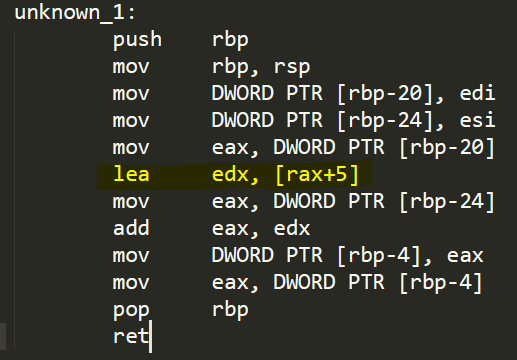

# Team Notes

## Practice Notes

*Date (29 JAN 2020)*  

1) Work through the creation of `add.c` and `add.s` (c and assembly respectively)

`gcc -S <filename>` gives back assembly code of file 
`a.out` is the (default) compiled file that `gcc add.c` returns; `gcc add.c -o add` would return the same compiled file named `add`
`echo $?`: check return value

2) Create a file `calc.c` that uses the add function from the attached object file `badmath.o` defined by the attached header file `badmath.h` , to return 3+4

`badmath.o` is a binary file identified by `.o`.
`badmath.h` is a header file that you include in calc.c so that you can define the functions (in this case add(x, y)).
`gcc -o calc calc.c badmath.o` to compile the file.

`badmath` returned 10 because, when the `add` function was called, `lea (%rax, %rax, 1), %edx` multiplies our first value 3\*2=6 and adds our second value to it when `add %edx, %eax` occurs. So 3\*2+4 = 10!

`rand` was never called. 

3) Not Gonna Lie, Kinda fell behind in the midst of taking notes, just going to listen to the rest (creating goodmath)

*Date (30 JAN 2020)*

Levels of Abstraction such as:
- C code
- Assembly Code
- Computer Logic i.e. gates, clocks, circuit layout, etc.

[Registers](https://www.tutorialspoint.com/assembly_programming/assembly_registers.htm):

TL;DR:
- rbp(ebp): Base Pointer
- rsp(esp): Stack Pointer
- rip(eip): Instruction Pointer
- rax(eax): Return Register

1) **AX is the primary accumulator**; it is used in input/output and most arithmetic instructions. For example, in multiplication operation, one operand is stored in EAX or AX or AL register according to the size of the operand.

2) **BX is known as the base register**; as it could be used in indexed addressing.

3) **CX is known as the count register**; as the ECX, CX registers store the loop count in iterative operations.

4) **DX is known as the data register**; It is also used in input/output operations. It is also used with AX register along with DX for multiply and divide operations involving large values.

5) **Instruction Pointer (IP)**; The 16-bit IP register stores the offset address of the next instruction to be executed. IP in association with the CS register (as CS:IP) gives the complete address of the current instruction in the code segment.

6) **Stack Pointer (SP)**; The 16-bit SP register provides the offset value within the program stack. SP in association with the SS register (SS:SP) refers to be current position of data or address within the program stack.

7) **Base Pointer (BP)**; The 16-bit BP register mainly helps in referencing the parameter variables passed to a subroutine. The address in SS register is combined with the offset in BP to get the location of the parameter. BP can also be combined with DI and SI as base register for special addressing.

8) **Source Index (SI)**; It is used as source index for string operations.

9) **Destination Index (DI)**; It is used as destination index for string operations

**Note: Intel uses (mov Dest, Source)**

D(Rb,Ri,S) == Mem[Reg[Rb] + S\*Reg[Ri] + D]

First S\*Ri; then Rb + sum; finally result + D

Sizing:

- movq (8 bytes = quad word)
- movl (4 bytes = long)
- movw (2 bytes = word)
- movb (1 byte = byte)

*Date (04 FEB 2020)*

The highlighted assembly is code optimization for adding. In this case, rax (a value/number) is added with '5'. The result is stored in edx

*Date (05 FEB 2020)*

## Challenge Notes

### Web Exploitation

*Bite Me*

## Things I've Learned / Misc

*Working with GIT (29 JAN 2020)*
- Pull/Push
- Add
- Commit
- Status
- Checkout

*Misc (29 JAN 2020)*

`echo $?` prints exit status of last function, command, script

`readelf -s <filename>` gives back list of symbols

SSH_tunneling/proxy (31JAN20 Folder for more info)

# Sad Boi Hours / Hello Darkness My Old Friend / Safe Space
- I spent 10 min wondering why `objdump -s <filename>` was not giving me symbols. It's `readelf -s` ...
